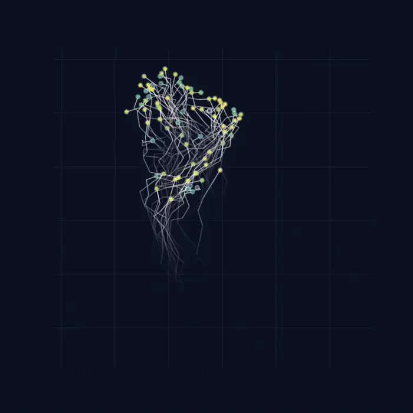

# Future Anticipation Maximization (FAM) Model

Future Anticipation Maximization (FAM) is a decentralized mechanism for generating flexible collective behaviour through local interactions. Instead of explicitly representing future states or optimizing long-term trajectories, each individual locally maintains future behavioural possibilities by interacting with its neighbours. This simple principle produces spontaneous transitions between collective states while preserving both stability and adaptability.

This repository contains the reference implementation of the FAM model, together with the analysis pipeline and figure-generation scripts used in our study. The repository enables reproduction of the main simulation results and provides a starting point for further investigations of self-organized collective behaviour, criticality, and biologically inspired swarm systems.


## Repository Structure

```
.
├── simulation/        # Swarm simulation
├── analysis/          # Data analysis
├── figures/           # Scripts for reproducing figures
├── data/
│   ├── processed/
│   └── trajectories/
├── movies/            # Example movies
├── outputs/
└── README.md
```

---

## Installation

Clone this repository

```bash
git clone https://github.com/USERNAME/FMA-model.git
cd FMA-model
```

Create a virtual environment

```bash
python -m venv .venv
source .venv/bin/activate
```

Install the required packages

```bash
pip install -r requirements.txt
```

---

## Running a Simulation

Generate one example simulation

```bash
python simulation/fma_simulation.py
```

Generate the animation

```bash
python simulation/animation.py
```

---

## Example Animation

An example simulation generated by the FAM model is available below.



The animation shows a representative collective trajectory generated by the FAM model.

## Reproducing the Main Figures

The main figures can be reproduced using

```bash
python figures/Figure_1.py
python figures/Figure_2B.py
python figures/Figure_2C.py
python figures/Figure_3.py
python figures/Figure_4A.py
python figures/Figure_4B.py
python figures/Figure_5.py
python figures/Figure_6A.py
python figures/Figure_6B.py
python figures/Figure_7.py
python figures/Figure_8.py
```

---

## Data

Representative datasets required to reproduce the main figures are included in this repository.

Large-scale simulation datasets used for parameter sweeps are not included.

---

## Citation

If you use this code in your research, please cite the corresponding publication.

*Citation information will be added after publication.*

---

## License

MIT License
